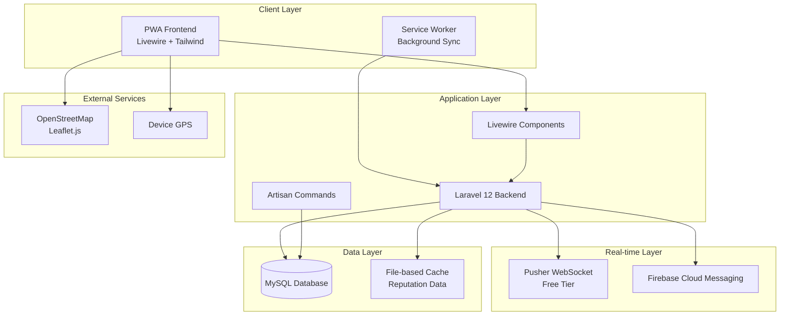

# Design Document

## Overview

The BUBT Realtime Bus Update system is a Progressive Web Application (PWA) built with Laravel 12, Livewire 3, and Tailwind CSS/DaisyUI. The system provides intelligent, automatic bus tracking using students' mobile devices as GPS trackers, with real-time location consensus, traffic jam detection, and flexible route management. The architecture is designed for shared cPanel hosting with MySQL database, Pusher WebSocket, and Firebase Cloud Messaging (FCM) for push notifications.

### Key Design Principles

- **Zero Hardware Dependency**: Uses students' smartphones as GPS trackers
- **Automatic Operation**: Minimal admin intervention through intelligent trip detection
- **Shared Hosting Compatible**: Works on cPanel without Redis or VPS requirements
- **Real-time Performance**: Sub-100ms location consensus with database optimization
- **Cost-Effective**: Uses free services (OpenStreetMap, Pusher free tier, FCM)

## Architecture

### System Architecture Diagram



### Technology Stack

- **Backend**: Laravel 12 with PHP 8.2+
- **Frontend**: Livewire 3 + Alpine.js + Tailwind CSS + DaisyUI + Toastr.js
- **Database**: MySQL 8.0+ with optimized indexes
- **Real-time**: Pusher Channels (free tier) for WebSocket
- **Push Notifications**: Firebase Cloud Messaging (FCM)
- **Maps**: OpenStreetMap with Leaflet.js
- **Caching**: File-based caching for shared hosting compatibility
- **PWA**: Service Worker with Background Sync API

## Components and Interfaces

### Database Schema

```sql
-- Buses table
CREATE TABLE buses (
    id BIGINT PRIMARY KEY AUTO_INCREMENT,
    name VARCHAR(50) NOT NULL, -- B1, B2, B3, B4, B5
    route_name VARCHAR(100) NOT NULL, -- Buriganga, Brahmaputra, etc.
    status ENUM('active', 'inactive') DEFAULT 'active',
    created_at TIMESTAMP DEFAULT CURRENT_TIMESTAMP,
    updated_at TIMESTAMP DEFAULT CURRENT_TIMESTAMP ON UPDATE CURRENT_TIMESTAMP,
    INDEX idx_status (status)
);

-- Stops table
CREATE TABLE stops (
    id BIGINT PRIMARY KEY AUTO_INCREMENT,
    bus_id BIGINT NOT NULL,
    name VARCHAR(100) NOT NULL,
    latitude DECIMAL(10, 8) NOT NULL,
    longitude DECIMAL(11, 8) NOT NULL,
    radius INT DEFAULT 50, -- meters
    sequence_order INT NOT NULL,
    direction ENUM('to_campus', 'from_campus') NOT NULL,
    created_at TIMESTAMP DEFAULT CURRENT_TIMESTAMP,
    updated_at TIMESTAMP DEFAULT CURRENT_TIMESTAMP ON UPDATE CURRENT_TIMESTAMP,
    FOREIGN KEY (bus_id) REFERENCES buses(id) ON DELETE CASCADE,
    INDEX idx_bus_direction (bus_id, direction),
    INDEX idx_location (latitude, longitude)
);

-- Schedules table
CREATE TABLE schedules (
    id BIGINT PRIMARY KEY AUTO_INCREMENT,
    bus_id BIGINT NOT NULL,
    direction ENUM('to_campus', 'from_campus') NOT NULL,
    departure_time TIME NOT NULL,
    days_of_week JSON NOT NULL, -- [1,2,3,4,5,6,7] for Mon-Sun
    is_active BOOLEAN DEFAULT TRUE,
    created_at TIMESTAMP DEFAULT CURRENT_TIMESTAMP,
    updated_at TIMESTAMP DEFAULT CURRENT_TIMESTAMP ON UPDATE CURRENT_TIMESTAMP,
    FOREIGN KEY (bus_id) REFERENCES buses(id) ON DELETE CASCADE,
    INDEX idx_bus_schedule (bus_id, departure_time, is_active)
);

-- Trips table (active trips)
CREATE TABLE trips (
    id BIGINT PRIMARY KEY AUTO_INCREMENT,
    bus_id BIGINT NOT NULL,
    schedule_id BIGINT,
    direction ENUM('to_campus', 'from_campus') NOT NULL,
    status ENUM('running', 'finished', 'cancelled') DEFAULT 'running',
    scheduled_start_time DATETIME,
    actual_start_time DATETIME,
    end_time DATETIME,
    delay_minutes INT DEFAULT 0,
    is_delayed BOOLEAN DEFAULT FALSE,
    passenger_count INT DEFAULT 0,
    created_at TIMESTAMP DEFAULT CURRENT_TIMESTAMP,
    updated_at TIMESTAMP DEFAULT CURRENT_TIMESTAMP ON UPDATE CURRENT_TIMESTAMP,
    FOREIGN KEY (bus_id) REFERENCES buses(id),
    FOREIGN KEY (schedule_id) REFERENCES schedules(id),
    INDEX idx_status_bus (status, bus_id),
    INDEX idx_created_at (created_at)
);

-- Device reputation table
CREATE TABLE device_reputations (
    id BIGINT PRIMARY KEY AUTO_INCREMENT,
    device_uuid VARCHAR(255) UNIQUE NOT NULL,
    reputation_score INT DEFAULT 0,
    total_trips INT DEFAULT 0,
    successful_trips INT DEFAULT 0,
    last_activity DATETIME,
    student_id BIGINT NULL, -- Future use
    created_at TIMESTAMP DEFAULT CURRENT_TIMESTAMP,
    updated_at TIMESTAMP DEFAULT CURRENT_TIMESTAMP ON UPDATE CURRENT_TIMESTAMP,
    INDEX idx_device_uuid (device_uuid),
    INDEX idx_reputation (reputation_score),
    INDEX idx_last_activity (last_activity)
);

-- Location pings table (optimized for real-time)
CREATE TABLE pings (
    id BIGINT PRIMARY KEY AUTO_INCREMENT,
    trip_id BIGINT NOT NULL,
    device_uuid VARCHAR(255) NOT NULL,
    latitude DECIMAL(10, 8) NOT NULL,
    longitude DECIMAL(11, 8) NOT NULL,
    speed DECIMAL(5, 2), -- km/h
    accuracy INT, -- meters
    is_valid BOOLEAN DEFAULT TRUE,
    created_at TIMESTAMP DEFAULT CURRENT_TIMESTAMP,
    FOREIGN KEY (trip_id) REFERENCES trips(id) ON DELETE CASCADE,
    INDEX idx_trip_device_time (trip_id, device_uuid, created_at),
    INDEX idx_created_at (created_at),
    INDEX idx_trip_valid (trip_id, is_valid)
);

-- Push notification subscriptions
CREATE TABLE subscriptions (
    id BIGINT PRIMARY KEY AUTO_INCREMENT,
    device_uuid VARCHAR(255) NOT NULL,
    stop_id BIGINT NOT NULL,
    fcm_token TEXT NOT NULL,
    is_active BOOLEAN DEFAULT TRUE,
    created_at TIMESTAMP DEFAULT CURRENT_TIMESTAMP,
    updated_at TIMESTAMP DEFAULT CURRENT_TIMESTAMP ON UPDATE CURRENT_TIMESTAMP,
    FOREIGN KEY (stop_id) REFERENCES stops(id) ON DELETE CASCADE,
    INDEX idx_device_stop (device_uuid, stop_id),
    INDEX idx_active (is_active)
);

-- Trip histories (archived data)
CREATE TABLE trip_histories (
    id BIGINT PRIMARY KEY AUTO_INCREMENT,
    original_trip_id BIGINT NOT NULL,
    trip_data JSON NOT NULL,
    passenger_count INT,
    total_pings INT,
    archived_at TIMESTAMP DEFAULT CURRENT_TIMESTAMP,
    INDEX idx_archived_at (archived_at)
);
```

### Routing Structure

```php
// Student/Public Routes (Default)
Route::get('/', BusList::class)->name('home');
Route::get('/map', LiveMap::class)->name('live-map');
Route::get('/tracker', OnBusTracker::class)->name('tracker');
Route::post('/subscribe', [NotificationController::class, 'subscribe'])->name('subscribe');

// Admin Routes (Prefixed)
Route::prefix('admin')->middleware(['auth:admin'])->group(function () {
    Route::get('/', AdminDashboard::class)->name('admin.dashboard');
    Route::get('/schedules', ScheduleCrud::class)->name('admin.schedules');
    Route::get('/trips', TripControl::class)->name('admin.trips');
    Route::get('/live-map', AdminLiveMap::class)->name('admin.live-map');
    Route::get('/reports', ReportDashboard::class)->name('admin.reports');
});
```

### Core Livewire Components

#### 1. BusList Component (Student Interface)
```php
class BusList extends Component
{
    public $availableBuses = [];
    public $selectedBus = null;
    public $deviceUuid;
    public $isTracking = false;
    
    protected $listeners = [
        'busLocationUpdated' => 'updateBusLocation',
        'tripStatusChanged' => 'refreshBusList'
    ];
    
    public function mount()
    {
        $this->deviceUuid = $this->generateOrGetDeviceUuid();
        $this->loadAvailableBuses();
    }
    
    public function joinBus($busId)
    {
        // Verify device location and reputation
        if ($this->verifyDeviceLocation($busId)) {
            $this->isTracking = true;
            $this->selectedBus = $busId;
            $this->dispatchBrowserEvent('toastr:success', [
                'message' => 'Successfully joined bus tracking!'
            ]);
        } else {
            $this->dispatchBrowserEvent('toastr:error', [
                'message' => 'Unable to join bus. Check your location and try again.'
            ]);
        }
    }
    
    public function leaveBus()
    {
        $this->isTracking = false;
        $this->selectedBus = null;
        $this->dispatchBrowserEvent('toastr:info', [
            'message' => 'You have left the bus tracking.'
        ]);
    }
}
```

#### 2. LiveMap Component
```php
class LiveMap extends Component
{
    public $activeBuses = [];
    public $mapCenter = ['lat' => 23.8103, 'lng' => 90.4125]; // Dhaka
    
    protected $listeners = [
        'locationUpdate' => 'updateBusLocation'
    ];
    
    public function mount()
    {
        $this->loadActiveBuses();
    }
    
    public function render()
    {
        return view('livewire.live-map');
    }
}
```

#### 3. OnBusTracker Component
```php
class OnBusTracker extends Component
{
    public $tripId;
    public $deviceUuid;
    public $isTracking = false;
    public $lastLocation = null;
    
    public function startTracking($tripId)
    {
        $this->tripId = $tripId;
        $this->isTracking = true;
        // Initialize GPS tracking
    }
    
    public function sendLocationUpdate($lat, $lng, $speed, $accuracy)
    {
        // Validate and send location via WebSocket
    }
}
```

### Service Classes

#### 1. LocationConsensusService
```php
class LocationConsensusService
{
    public function calculateBusLocation($tripId): ?array
    {
        // Get recent pings from top 10 devices by reputation
        $recentPings = $this->getRecentPings($tripId);
        
        if (count($recentPings) < 2) {
            return $this->handleSingleDevice($recentPings);
        }
        
        // Apply weighted centroid algorithm
        return $this->calculateWeightedCentroid($recentPings);
    }
    
    private function calculateWeightedCentroid($pings): array
    {
        $totalWeight = 0;
        $weightedLat = 0;
        $weightedLng = 0;
        
        foreach ($pings as $ping) {
            $weight = max($ping->device_reputation, 1);
            $weightedLat += $ping->latitude * $weight;
            $weightedLng += $ping->longitude * $weight;
            $totalWeight += $weight;
        }
        
        return [
            'latitude' => $weightedLat / $totalWeight,
            'longitude' => $weightedLng / $totalWeight,
            'device_count' => count($pings),
            'confidence' => $this->calculateConfidence($pings)
        ];
    }
}
```

#### 2. ReputationService
```php
class ReputationService
{
    private $cacheFile = 'storage/app/reputation_cache.json';
    
    public function updateReputation($deviceUuid, $action)
    {
        $reputation = $this->getReputation($deviceUuid);
        
        switch ($action) {
            case 'successful_trip':
                $reputation['score'] += 1;
                $reputation['successful_trips']++;
                break;
            case 'invalid_location':
                $reputation['score'] -= 2;
                break;
        }
        
        $this->saveReputation($deviceUuid, $reputation);
    }
    
    public function isDeviceEligible($deviceUuid): bool
    {
        $reputation = $this->getReputation($deviceUuid);
        return $reputation['score'] >= 0;
    }
}
```

#### 3. TripDetectionService
```php
class TripDetectionService
{
    public function detectTripStart($deviceUuid, $lat, $lng): ?int
    {
        // Check if device is near any route's first stop
        $nearbyRoutes = $this->findNearbyRoutes($lat, $lng);
        
        foreach ($nearbyRoutes as $route) {
            if ($this->isWithinScheduleWindow($route)) {
                return $this->createTrip($route, $deviceUuid);
            }
        }
        
        return null;
    }
    
    public function detectTripEnd($tripId): bool
    {
        $trip = Trip::find($tripId);
        $recentPings = $this->getRecentPings($tripId, 10); // Last 10 minutes
        
        // Check if devices are stationary at final destination
        return $this->isAtFinalDestination($trip, $recentPings) &&
               $this->isStationary($recentPings, 10); // 10 minutes
    }
}
```

## Data Models

### Location Consensus Algorithm

The system uses a weighted centroid algorithm to determine the actual bus location from multiple tracking devices:

```
Final_Location = Σ(Device_Location × Device_Reputation) / Σ(Device_Reputation)

Where:
- Device_Location = (latitude, longitude) from GPS
- Device_Reputation = reputation score (minimum 1, maximum unbounded)
- Only devices with reputation ≥ 0 participate in voting
- Maximum 10 devices with highest reputation are selected
- Minimum 2 devices required (except during scheduled time windows)
```

### Traffic Jam Detection

Traffic jam detection uses multiple indicators:

```
Traffic_Jam_Detected = (
    Average_Speed < 5 km/h AND
    Stationary_Time > 5 minutes AND
    Multiple_Devices_Consistent = true
)

Status_Updates:
- "Moving" (speed > 5 km/h)
- "Slow Traffic" (speed 1-5 km/h)
- "Traffic Jam" (speed < 1 km/h for 5+ minutes)
- "Stationary" (speed = 0 for 10+ minutes)
```

## Error Handling

### Location Validation

```php
class LocationValidator
{
    public function validateLocation($lat, $lng, $speed, $tripId): bool
    {
        // Speed validation
        if ($speed > 70) return false;
        
        // Route validation
        if (!$this->isOnRoute($lat, $lng, $tripId)) return false;
        
        // Accuracy validation
        if ($accuracy > 100) return false; // meters
        
        return true;
    }
    
    public function isOnRoute($lat, $lng, $tripId): bool
    {
        $route = $this->getRoutePolyline($tripId);
        $distance = $this->distanceToPolyline($lat, $lng, $route);
        
        return $distance <= 200; // 200 meters tolerance
    }
}
```

### WebSocket Error Handling

```php
class WebSocketHandler
{
    public function handleLocationUpdate($data)
    {
        try {
            $this->validateLocationData($data);
            $this->processLocationUpdate($data);
            $this->broadcastUpdate($data);
        } catch (ValidationException $e) {
            $this->penalizeDevice($data['device_uuid']);
            Log::warning('Invalid location data', $data);
        } catch (Exception $e) {
            Log::error('WebSocket error', ['error' => $e->getMessage()]);
            $this->queueForRetry($data);
        }
    }
}
```

## Testing Strategy

### Unit Testing

1. **Location Consensus Algorithm**
   - Test weighted centroid calculation
   - Test device reputation impact
   - Test edge cases (single device, no devices)

2. **Reputation System**
   - Test score updates
   - Test eligibility checks
   - Test file-based caching

3. **Trip Detection**
   - Test automatic trip start/end
   - Test schedule window validation
   - Test geo-fence detection

### Integration Testing

1. **WebSocket Communication**
   - Test real-time location updates
   - Test connection handling
   - Test error recovery

2. **Database Performance**
   - Test location consensus queries (< 100ms)
   - Test batch insert operations
   - Test cleanup operations

### End-to-End Testing

1. **Complete Trip Flow**
   - Student joins bus → tracking starts → location updates → trip ends
   - Multiple students on same bus
   - Traffic jam scenarios

2. **PWA Functionality**
   - Background tracking
   - Offline capability
   - Push notifications

### Performance Testing

1. **Load Testing**
   - 50 concurrent buses
   - 500 tracking devices
   - 1000+ location updates per minute

2. **Database Optimization**
   - Query performance under load
   - Index effectiveness
   - Cleanup operation impact

## Deployment Architecture

### Shared Hosting Setup

```bash
# cPanel File Structure
public_html/
├── index.php (Laravel entry point)
├── assets/ (compiled CSS/JS)
└── storage/ -> ../storage (symlink)

app_root/
├── app/
├── config/
├── database/
├── resources/
├── routes/
└── storage/
    ├── app/
    │   ├── reputation_cache.json
    │   └── location_cache/
    └── logs/
```

### Environment Configuration

```env
# Database
DB_CONNECTION=mysql
DB_HOST=localhost
DB_DATABASE=bubt_bus_tracker
DB_USERNAME=your_username
DB_PASSWORD=your_password

# Broadcasting (Pusher - works on localhost)
BROADCAST_DRIVER=pusher
PUSHER_APP_ID=your_app_id
PUSHER_APP_KEY=your_app_key
PUSHER_APP_SECRET=your_app_secret
PUSHER_APP_CLUSTER=ap2
# Pusher free tier works perfectly for localhost development

# Push Notifications (FCM)
FCM_SERVER_KEY=your_fcm_server_key

# Cache (File-based for shared hosting)
CACHE_DRIVER=file
SESSION_DRIVER=file
QUEUE_CONNECTION=database

# Development Settings
APP_ENV=local
APP_DEBUG=true
APP_URL=http://localhost:8000
```

### Development & Testing Setup

```bash
# Localhost Development Commands
php artisan serve                    # Start Laravel dev server
php artisan schedule:work           # Run scheduler locally (instead of cron)
php artisan queue:work              # Process background jobs
php artisan websockets:serve        # If using Laravel WebSockets locally

# Testing Commands
php artisan test                    # Run all tests
php artisan test --filter=LocationConsensusTest
php artisan notify:near-stops       # Test push notifications locally
php artisan trips:archive           # Test cleanup commands
```

### Cron Job Configuration

```bash
# cPanel Cron Jobs
# Every minute - Laravel scheduler
* * * * * cd /home/username/app_root && php artisan schedule:run >> /dev/null 2>&1

# Every 30 seconds - Push notifications
* * * * * cd /home/username/app_root && php artisan notify:near-stops
* * * * * sleep 30 && cd /home/username/app_root && php artisan notify:near-stops

# Daily cleanup
0 2 * * * cd /home/username/app_root && php artisan trips:archive
0 3 * * * cd /home/username/app_root && php artisan db:optimize
```

This design provides a comprehensive, scalable, and cost-effective solution for the BUBT Realtime Bus Update system that meets all the specified requirements while being optimized for shared hosting environments.